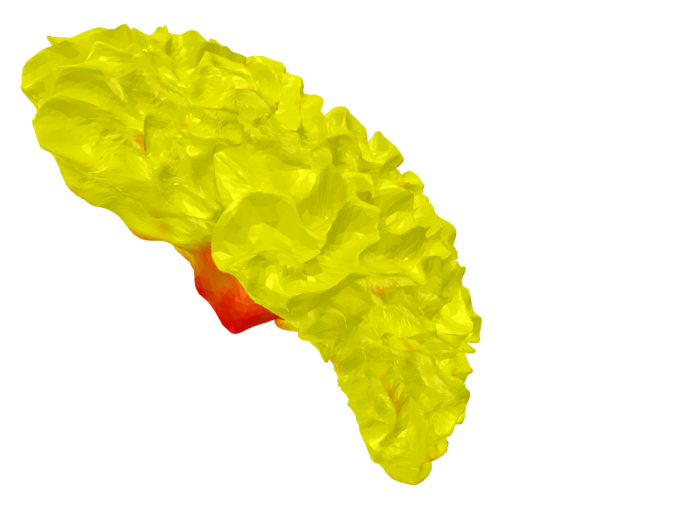

## 3D Mesh Visualization with PyTorch3D and Trimesh

To visualize a `.PLY` file, this Python script employs the `trimesh` library along with `matplotlib`. Although `PyTorch3D` is present, it lacks a direct function for 3D mesh visualization. The script constructs the absolute path to the `.PLY` file, checks its existence, and loads it using `trimesh`. While `PyTorch3D` provides a `load_obj` function, it's specifically tailored for loading 3D object files in the Wavefront `.obj` format. As the file in this script is in `.PLY` format, the more appropriate `trimesh.load` is utilized for handling the specific file format. Feel free to experiment by using `load_obj` with `.obj` files in the `PyTorch3D` library if your meshes are in that format. Ensure you have `trimesh`, `matplotlib`, and other dependencies installed before running the script.

Here's a step-by-step guide:
### Install Required Libraries
```
pip install pytorch3d matplotlib trimesh
```
### Importing Libraries
```
import os
import torch
from pytorch3d.io import load_obj
import matplotlib.pyplot as plt
import trimesh
```

### Loading a .PLY File
```
ply_file_path = os.path.join("path/to/your/file.ply")

if os.path.exists(ply_file_path):
    mesh = trimesh.load(ply_file_path)
else:
    print(f"File not found: {ply_file_path}")
```
### Visualization using Trimesh Viewer

```
mesh.show()
```
### Visualization using Matplotlib
```
plt.figure(figsize=(5, 5))
plt_3d = plt.axes(projection='3d')
plt_3d.add_collection3d(trimesh.plotting.plot_trisurf(mesh, color=(0.5, 0.5, 0.5, 1.0)))
plt.show()
```

### Brain Visualization Samples
<p float="left">
  
  
  
</p>


### Overall Purpose
The code's primary purpose is to load a 3D mesh from a .PLY file and visualize it using both the built-in viewer from trimesh and matplotlib.
